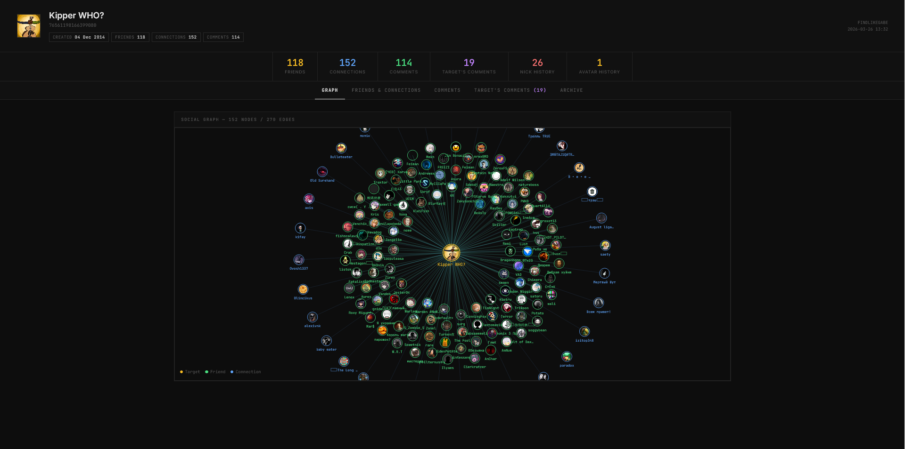

Steam OSINT tool — collects and visualizes social connections of any Steam account.

---

## 🔍 What it does

- Fetches profile summary, avatar, account creation date
- Pulls full comment history and extracts commentator IDs
- Retrieves friend list (if public)
- If friend list is **private** — reconstructs connections via **3-step handshake**:
  - **1st** — checks commentators' friend lists for the target
  - **2nd** — checks friends-of-commentators
  - **3rd** — checks friends-of-friends-of-commentators
- Fetches profile archive: nickname history, real name history, URL history, avatar history
- Generates a self-contained **HTML report** with interactive D3 grap

---

## ⚙️ Installation

```bash
git clone https://github.com/youngrebe/findlikegabe
cd findlikegabe
python -m venv venv
pip install -r requirements.txt
```

---

## 🔑 Setup

```bash
# Get your Steam API key at https://steamcommunity.com/dev/apikey
python config.py
```

---

## 👻 Usage
```bash
python findlikegabe.py
```


